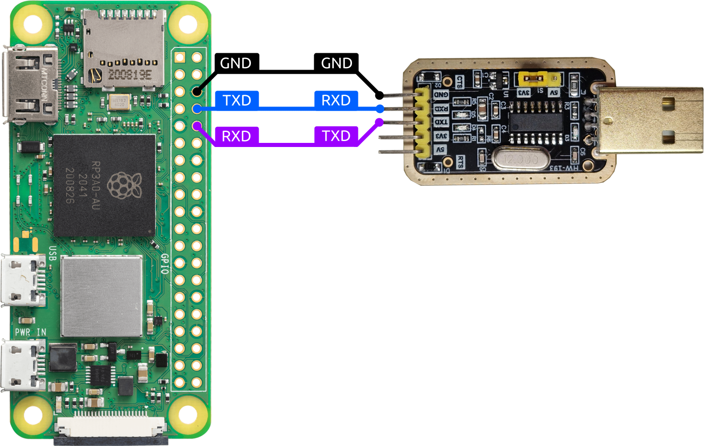

# ZeroM2M  <!-- omit from toc -->

## Table of Contents <!-- omit from toc -->

- [Project Overview](#project-overview)
- [Hardware](#hardware)
- [Configuration](#configuration)
- [Docs](#docs)
- [Third-Party Components](#third-party-components)
- [License](#license)

## Project Overview

ZeroM2M is a bare-metal oneM2M resource server designed to run directly on the Raspberry Pi Zero 2 W hardware platform without requiring a general-purpose operating system.  
The project implements a functional HTTP-based oneM2M stack with priority given to the development of POST and GET operations.  
Supports the following core oneM2M resources:

- AE (Application Entity)
- CNT (Container)
- CI (Content Instance)
- Subscription resources

## Hardware

ZeroM2M is developed and tested for the **Raspberry Pi Zero 2 W**.

> Default configurations are provided only for this platform.  
> Circle may allow the project to run on other Raspberry Pi models, but this has not been tested and may require adjustments.

### Required Hardware

- Raspberry Pi Zero 2 W
- Micro SD card
- Micro SD card reader/writer
- 5V power supply (micro-USB, capable of at least 2.5A recommended)

### Recommended Hardware

For development and debugging it is strongly recommended to use a **USB-to-TTL serial adapter** connected to the Raspberry Pi UART pins. This allows you to:

- View runtime logs on a serial terminal
- Use the bootloader for easy kernel flashing without touching the SD card

> Logs can also be sent to a display via the Mini HDMI port. See configuration of [cmdline.txt](#cmdlinetxt).

See [Boot Makefile](docs/building.md#boot-makefile) and [Developing with the Bootloader](docs/workflow.md) for details.

| Raspberry Pi GPIO | Adapter Pin |
| :--- | :--- |
| Ground | Ground |
| GPIO 14 (TXD) | RXD |
| GPIO 15 (RXD) | TXD |

## Configuration

### Config.mk

[Config.example.mk](Config.example.mk) provides a base configuration file containing both Circle and project-specific settings. This includes options such as the compiler toolchain prefix, target architecture, C++ standard, and build settings like the reboot magic word, serial port, and baud rates used for flashing and runtime communication.

To configure the project, copy `Config.example.mk` to `Config.mk` and adjust the options as needed.

During the build process, this file is symlinked into the Circle directory as `third_party/circle/Config.mk`. This allows both Circle and the project to use the same configuration file for building and runtime settings remain consistent.

### system.cfg

[boot/system.example.cfg](boot/system.example.cfg) is the main configuration file for the project. It uses a simple INI-like format with sections and key-value pairs.  
The file is parsed at runtime by the kernel to configure various aspects of the system.

Copy this file to `boot/system.cfg` and edit the options as needed.

> When mode is set to wifi, and kernel fails to connect to the Wi-Fi network, it will automatically fall back to Ethernet mode.

### wpa_supplicant.conf

[boot/wpa_supplicant.example.conf](boot/wpa_supplicant.example.conf) is an example configuration file for the WPA Supplicant, which is responsible for managing Wi-Fi connections. Copy this file to `boot/wpa_supplicant.conf` and edit the SSID, PSK, and other options as needed to connect to your Wi-Fi network.

### cmdline.txt

[boot/cmdline.example.txt](boot/cmdline.example.txt) is the Raspberry Pi boot command line file. It can contain multiple boot parameters.  
In this project it is currently used only to set the log output device.  
If you want to see logs on a screen, simply remove this file from the SD Card.
[third_party/circle/doc/cmdline.txt](third_party/circle/doc/cmdline.txt) has more details on the available options.

Copy the example file to `boot/cmdline.txt` and edit the options as needed.

### config.txt

[boot/config.example.txt](boot/config.example.txt) is the Raspberry Pi firmware configuration file.  
It controls low-level boot settings such as the CPU mode, memory layout, enabled peripherals, and which kernel image is loaded.

Copy the example file to `boot/config.txt` and edit the options as needed.

## Docs

- Building the project: [docs/building.md](docs/building.md)
- Example workflows: [docs/workflow.md](docs/workflow.md)
- QEMU setup: [docs/qemu.md](docs/qemu.md)

## Third-Party Components

This project uses the Circle bare-metal framework:

- Circle: <https://github.com/rsta2/circle>  
  License: GNU General Public License v3.0 (GPL-3.0)

## License

ZeroM2M is licensed under the GNU General Public License v3.0 (GPL-3.0).

Copyright (C) 2026 ZeroM2M Authors

See the [LICENSE file](LICENSE) for the full license text.
