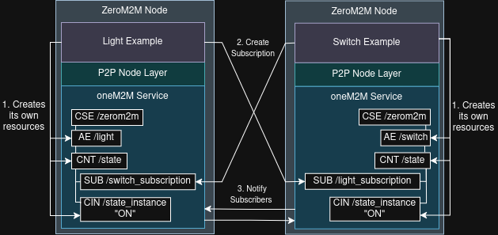

# P2P Examples <!-- omit from toc -->

[Back to README](../README.md#docs)

## Table of Contents <!-- omit from toc -->

- [Overview](#overview)
- [Architecture](#architecture)
- [The Light and Switch Example](#the-light-and-switch-example)
- [Configuration](#configuration)
- [Adding New P2P Tasks](#adding-new-p2p-tasks)
- [Running the Examples](#running-the-examples)

## Overview

Each P2P task is a subclass of `P2PNode`, which in turn extends `CTask`. Constructing the task automatically registers it with the Circle scheduler. The active task is chosen at runtime by the `p2p_task` key in `system.cfg`.

> ZeroM2M supports baking multiple task implementations into a single kernel image and selecting which one runs at boot time via configuration. You can also just compile multiple tasks into the different images for each node if you prefer, but the former allows you to maintain a single image for all nodes and switch between behaviors by editing config and rebooting.  

This is the basis for P2P (peer-to-peer) scenarios, where each node runs its own full oneM2M resource server and communicates directly with peer nodes, no shared or external CSE is involved.

## Architecture

Each node runs a complete oneM2M stack: it hosts its own CSE, writes resources locally, and subscribes to resources on the peer's CSE. Notifications are delivered directly from one node's HTTP server to the other's.



The flow for each node is, for the example i will talk about below:

1. On boot, register its own AE and Container on its local CSE.
1. Send a `Subscription` resource to the **peer's**, asking to be notified of new `ContentInstance` children under the peer's `Container`. The `notificationURI` in that subscription points back at the subscribing node's own HTTP server.
1. When the peer creates a new `ContentInstance`, the peer's CSE delivers an HTTP notification directly to the subscriber's address. The notification is handled and  dispatched to `OnData()`, where the node acts on the content.

Because each node is both a oneM2M server and a client, the two Pis communicate entirely peer-to-peer without any intermediary.

## The Light and Switch Example

The project ships with a two-node demo:

| Role | Task class | p2p_task |
| :--- | :--- | :--- |
| Light | `tasks::LightExample` | 0 |
| Switch | `tasks::SwitchExample` | 1 |

### How it works

**Switch node**: runs a loop that toggles its own boolean state every 3 seconds and creates a new `ContentInstance` ("ON" or "OFF") under `/switch/state` on its local CSE. It also subscribes to `/light/state` on the light node, so it receives and logs light-state change notifications.

**Light node**: subscribes to `/switch/state` on the switch node. When the switch node's CSE delivers a notification for a new `ContentInstance`, `OnData()` reads the content string and drives the onboard Activity LED accordingly. The light does not generate state changes on its own; it only reacts to what the switch publishes.

## Configuration

### system.cfg

The key that selects which task runs is `p2p_task` under the `[system]` section. Each node needs its own `boot/system.cfg`. Check [boot/system.example.cfg](../boot/system.example.cfg) for the full config file.

Minimum for Light node `system.cfg`:

```cfg
[system]
p2p_task = 0
```

Minimum for Switch node `system.cfg`:

```cfg
[system]
p2p_task = 1
```

#### How to set URIs for the peer nodes

For simplicity, the example tasks use hardcoded IP addresses and ports for the peer nodes. In a real deployment, you would likely want to extend the `system.cfg` with these values, but for testing and demonstration purposes, hardcoding is sufficient.

In [switch_example.cpp](../zerom2m/src/tasks/switch_example.cpp) and [light_example.cpp](../zerom2m/src/tasks/light_example.cpp), update two things inside `Run()`:

```cpp
// 1. The node's own address, used as the notificationURI registered on the others CSE.
//    This should be the node's actual IP address
url.Format("http://%s:%u/", net_->GetIP().c_str(), config_->http.port);

// 2. The other node's address, where the subscription request is sent.
const u8 ip[4] = {192, 0, 2, 1}; 
u16 lightPort = 8080;
```

> If you are running inside a VM without bridged networking, `net_->GetIP()` may return the wrong address for the `notificationURI`. In that case, hardcode your host machine's IP and port in the `url.Format(...)`, check the XXX comments in both source files.

## Adding New P2P Tasks

To add a new task:

1. Create a class that inherits from `P2PNode` and implements `OnVerification()`, `OnData()`, and `Run()`.

2. Add a new `else if` branch in `SystemManager::StartServices()` with the next available integer, or just remove the if and put you task in the default branch if you don't need to switch between multiple tasks on the same image:

```cpp
// Add new tasks here:
if (config_.system.p2p_task == 0) {
    auto *myTask0 =
        new tasks::LightExample(&scheduler_, &networkManager_, httpBinding, &config_, &led_);
    onem2m::OneM2MService::Get().SetOnNotificationHandler(myTask0);

} else if (config_.system.p2p_task == 1) {
    auto *myTask1 =
        new tasks::SwitchExample(&scheduler_, &networkManager_, httpBinding, &config_);
    onem2m::OneM2MService::Get().SetOnNotificationHandler(myTask1);
} else {
    //...
}
```

## Running the Examples

Check the [workflow.md](workflow.md) for instructions on building and using the images.
